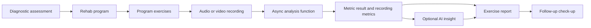
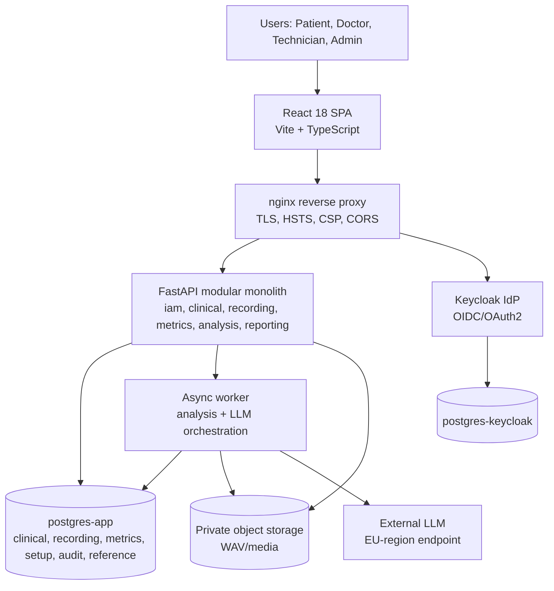
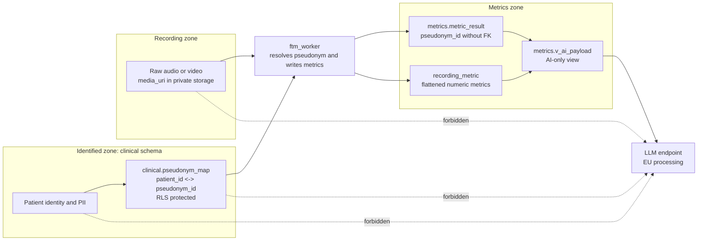
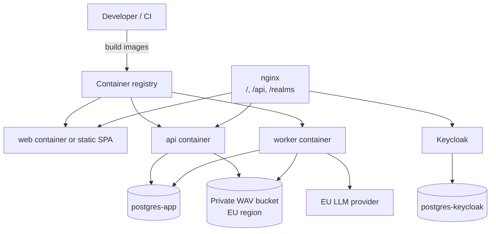
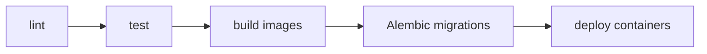

# Plan

This file distills `doc/sdd/FTM_SDD_1_8.md` and `doc/architecture/ADR_from_SDD_1.8.md` into an implementation-oriented architecture reference. ADRs win over the SDD for concrete decisions; unresolved details are marked as TODO instead of being invented.

# FTM Architecture

## 1. Summary and context

**FTM (Medical Rehab Follow-up Check-up Tool)** helps monitor patient progress in rehabilitation programs. The system records diagnoses, rehabilitation programs, exercise recordings, extracted metrics, optional AI insights, exercise reports and follow-up check-ups (SDD §1, §4).

Primary actors are Patient, Doctors (GP, Medical Specialist, Medical Technical Specialist / Technician), AI system, external authentication/authorization system, application, and Administrator (SDD §3).

High-level flow:

The MVP is a **modular monolith** plus an asynchronous worker. Modules are logical service boundaries today and possible physical services later (ADR-0001). The app must protect health data, voice recordings and AI egress through Keycloak, PostgreSQL schemas, RLS, pseudonymization and EU data residency (SDD §6.1, §12; ADR-0004, ADR-0013, ADR-0014, ADR-0015).

## 2. Key decisions

| Decision | Choice | ADR / source |
|---|---|---|
| Application shape | Modular monolith; modules are future services; worker is separate for heavy processing. | ADR-0001 |
| Backend | Python 3.12, FastAPI, Pydantic v2, SQLAlchemy 2.0, Alembic. | ADR-0002 |
| Frontend | React 18, Vite, TypeScript, TanStack Query, Recharts, `keycloak-js`. | ADR-0003 |
| Authentication | Keycloak; SPA uses Authorization Code + PKCE S256; backend is bearer-only and validates JWT via JWKS. | ADR-0004 |
| App database | PostgreSQL app DB split into schemas; Keycloak DB is separate. | ADR-0005 |
| Recording storage | Private object storage for WAV/media; DB stores metadata only. | ADR-0006 |
| Async processing | Worker container for metric extraction and LLM calls; timeout and error capture required. | ADR-0007 |
| Metric model | Analysis is agnostic; setup declares function endpoint/name and metric definitions; core stores raw JSON + flattened metrics. | ADR-0008, SDD §7.2, §7.4 |
| Clinical traceability | Use git/deploy metadata: `function_name`, `function_version`, `code_sha`, `status`, `error_detail`. | ADR-0009 |
| Reanalysis | `metric_result.recording_id` is unique; reanalysis updates current result. | ADR-0010 |
| Analysis trigger | Doctor or patient with RLS read access triggers async analysis; technician is excluded by RLS. | ADR-0011, AC-11 |
| Attestation | MVP simple attestation: IdP subject + `colegiado_id` + timestamp + `content_hash`; not qualified eIDAS signature. | ADR-0012, SDD §6.1 |
| AI anonymization boundary | LLM receives only pseudonymized metrics through `metrics.v_ai_payload`; no identity, media URI or audio. | ADR-0013, FR-17 |
| RLS | App connects as role login, sets `app.identity_id`, never as owner; doctors have clinic-level access in MVP. | ADR-0014 |
| EU residency | Recordings, database and LLM processing must remain in the EU. | ADR-0015, FR-16, FR-17 |
| Patient onboarding | Admin creates patients in MVP; no self-registration. | ADR-0016 |
| Migrations | SQL-first Alembic baseline executes `ftm_schema.sql`; views, roles, grants and RLS are handwritten. | ADR-0017 |
| Deployment | Containers behind nginx; extend existing IaC with `api`, `worker`, `postgres-app` and media bucket. | ADR-0018 |
| LLM/storage provider | Default Claude via EU Bedrock or EU Vertex; Mistral is sovereign alternative; storage in EU, preferably Spain. | ADR-0019 |

## 3. Component view

## 4. Anonymization boundary

> **Central invariant:** identity, PII and raw audio **never** cross to the LLM. Voice is biometric special-category data. The LLM receives only pseudonymized metrics and reviewed criteria (SDD §6.1, FR-17; ADR-0013, ADR-0015).

The identity-to-pseudonym map lives only in the identified zone: `clinical.pseudonym_map`, protected by RLS. `metrics.metric_result.pseudonym_id` intentionally has no FK, so deleting the map supports the right-to-forget path by making metrics de facto anonymous (ADR-0013).

LLM payloads may include `{ pseudonym_id, exercise, criteria, current_metrics, history }` only when those fields are derived from the pseudonymized metrics interface. They must not include identity, `recording_id`, `media_uri`, audio, direct patient data or raw free clinical text.

## 5. Data model by schemas and RLS

The ADR defines PostgreSQL schemas as `clinical`, `recording`, `metrics`, `setup`, `audit`, and `reference` (ADR-0005). The modular monolith uses bounded modules such as `iam`, `clinical`, `recording`, `metrics`, `analysis`, and `reporting` (ADR-0001). Therefore the table below maps requested architecture areas to the actual source-of-truth schemas instead of inventing schemas that the SDD/ADR do not define.

| Architecture area | Source-of-truth DB schema | Tables / entities | Who accesses it (RLS / grants) |
|---|---|---|---|
| `iam` | `clinical` + Keycloak DB | `app_user`; Keycloak stores credentials separately | App maps JWT `sub` to `app_user.external_subject`; credentials are not in app DB (ADR-0004). |
| `clinical` | `clinical` | `patient`, `doctor`, `diagnostic`, `rehab_program`, `program_exercise`, `patient_consent`, `exercise_report`, `followup_checkup`, `pseudonym_map` | Medical, GP and Patient under RLS; **AI never accesses `clinical`** (SDD §6.1; ADR-0013, ADR-0014). |
| `catalog` | `clinical` / `reference` | `rehab_exercise`; `metric_norm` in `reference` | Rehab exercise is clinical/catalog-like; reference norms are read by all roles and written by specialist/technician (SDD §7.1, §7.6). |
| `recording` | `recording` | `exercise_recording` metadata; media is in object storage | Medical, GP and Patient under RLS; **AI never accesses `recording` or raw media** (SDD §6.1; ADR-0006, ADR-0013). |
| `metrics` | `metrics` | `metric_result`, `recording_metric`, `ai_insight`, `v_ai_payload` | Medical, GP and Patient under RLS; AI reads only `metrics.v_ai_payload` pseudonymized view (ADR-0013). |
| `analysis` | `setup` | `analysis_setup`, `metric_definition`, `metric_composition` | Medical Specialist, Medical Technical Specialist and AI setup usage as specified; setup is isolated from patient identity (SDD §6.1, §7.2). |
| `reporting` | `clinical` | `exercise_report`, `exercise_report_recording`, `followup_checkup`, `followup_checkup_report` | Medical/GP/Patient according to clinical RLS and report ownership relationships (SDD §7.1). |
| `audit` | `audit` | `event_log` | Application/Admin; supports monitoring of create/update/delete events (FR-15, UC-15). |

> TODO (to confirm with product owner): whether the codebase should expose a separate `catalog` module/schema or keep `rehab_exercise` and `metric_norm` in the source-of-truth schemas above.

## 6. Analysis function registry

The analysis system is deliberately agnostic: the technical specialist defines what metrics exist and which function/endpoint produces them; the core executes and persists results without interpreting clinical semantics (ADR-0008, SDD §7.2, §7.4).

Required pattern:

| Concern | Rule | Trace |
|---|---|---|
| Registration | `analysis_setup.metric_api_endpoint` references the function/endpoint by name. | ADR-0008, SDD §7.2 |
| Function code | Functions ship with code through PR + review + deploy; no runtime code upload. | ADR-0008 |
| Execution | Worker executes analysis asynchronously with timeout and error capture. | ADR-0007 |
| Return contract | Return a metrics dictionary / JSON object with no PII. | ADR-0008, ADR-0013 |
| Persistence | Store `metric_result.raw_json` and flattened `recording_metric` rows. | SDD §7.4 |
| Traceability | Persist `function_name`, `function_version`, `code_sha`, `status`, `error_detail`. | ADR-0009 |
| Reanalysis | Update the 1:1 `metric_result`; no history in MVP. | ADR-0010 |

> TODO (to confirm with product owner / tech lead): the exact Python registry API, e.g. whether the implementation should use `@register_analysis("name_vN")` or another registry mechanism. The ADR/SDD specify registration by name but not a decorator.

## 7. Security and GDPR

| Area | Requirement |
|---|---|
| Authentication | Keycloak OIDC/OAuth2; SPA public client uses Authorization Code + PKCE S256; backend validates bearer JWT via JWKS (ADR-0004). |
| Roles | `medical`, `patient`, `technician`, `admin` per ADR-0004. |
| RLS | RLS is defense in depth; API also checks authorization. DB session must receive identity context via `SET app.identity_id`; app must not connect as owner (ADR-0014). |
| Pseudonymization | `clinical.pseudonym_map` is the identity bridge; AI reads only pseudonymized `metrics.v_ai_payload` (ADR-0013). |
| Voice data | Voice/audio is biometric special-category data; raw audio stays in private object storage and never goes to the LLM (ADR-0006, ADR-0013, FR-16/FR-17). |
| Consent | Patient consent is required for rehab-program recordings; revocation must preserve history as specified (FR-14, EC-7, SDD §7.1). |
| Attestation | Diagnostic and Exercise Report use simple MVP attestation; qualified signature remains pending PO/legal (ADR-0012). |
| Audit | Entity create/update/delete actions are logged in `audit.event_log` (FR-15, UC-15). |
| Residency | Database, recordings and LLM processing must stay in the EU; service is limited to Spain (ADR-0015, SDD §12). |
| Transport/storage protection | TLS is terminated at nginx; object storage is private; encryption at rest is required by the security context but exact mechanism is not specified. |

> TODO (to confirm with product owner / infra owner): exact secret store, encryption-at-rest implementation, backup encryption and key-management provider.

## 8. Deployment and CI/CD

Deployment extends the existing IaC shape: `nginx + keycloak + postgres-keycloak` with `api + worker + postgres-app` and a private WAV bucket (ADR-0018).

CI/CD pipeline shape:

The ADR/SDD specify the pipeline stages conceptually through the deployable container topology and Alembic migration strategy, but not exact commands or CI provider details.

> TODO (to confirm with product owner / DevOps owner): exact CI provider, image registry, deployment target, secret store, migration runner and rollback procedure.
