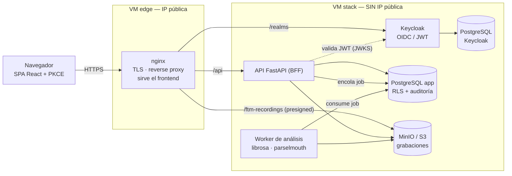

# FTM Rehab Follow-up Check-up Tool

**FTM** es una plataforma web para el seguimiento de programas de rehabilitación médica. Permite pasar de una valoración diagnóstica a un programa de ejercicios, registrar grabaciones de seguimiento, extraer métricas de forma asíncrona y consultar informes clínicos, manteniendo separación de roles, trazabilidad y controles de privacidad sobre datos sanitarios.

> Este README resume el proyecto y enlaza la documentación completa. Para ejecutar todo el entorno local paso a paso, usa [`RUNBOOK_local.md`](RUNBOOK_local.md).

## Acceso rápido

| Recurso | Enlace |
|---|---|
| Aplicación desplegada | <https://ftm-followup-checkup.duckdns.org/> |
| Vídeo de exposición y demo | <https://drive.google.com/file/d/1omFGS3u0IoVJcFhNXrV2xgIlVyqXvO6T/view?usp=drive_link> |

Credenciales de prueba: ver [Usuarios y contraseñas de prueba](#usuarios-y-contraseñas-de-prueba).

## Índice

1. [Descripción general del proyecto](#descripción-general-del-proyecto) · [Arquitectura](#arquitectura)
2. [Usuarios y contraseñas de prueba](#usuarios-y-contraseñas-de-prueba)
3. [Stack tecnológico utilizado](#stack-tecnológico-utilizado)
4. [Instalación y ejecución](#instalación-y-ejecución)
5. [Despliegue en cloud](#despliegue-en-cloud)
6. [Estructura del proyecto](#estructura-del-proyecto)
7. [Funcionalidades principales](#funcionalidades-principales)
8. [Testing](#testing)
9. [Documentación adicional](#documentación-adicional)
10. [Notas de seguridad para desarrollo](#notas-de-seguridad-para-desarrollo)

## Descripción general del proyecto

FTM (*Follow-up Check-up Tool*) es una herramienta de configuracion, registro y seguimiento de programas de rehabilitacion, y cubre el siguiente flujo clínico:

1. Un profesional sanitario consulta pacientes.
2. Crea diagnóstico del paciente y, a partir de él, un programa de rehabilitación asociado.
3. El programa se compone de ejercicios y configuraciones de análisis ya preconfigurados en la aplicacion.
4. El paciente acepta el consentimiento requerido y sube grabaciones de ejercicios.
5. Un worker procesa las grabaciones, extrae métricas y recomendaciones, y persiste el resultado a peticion del paciente.
6. Los profesionales consultan las grabaciones, sus métricas y recomendaciones, y elaboran informes y controles de seguimiento.
7. La interacción con IA está contemplada en el diseño para generar insights pseudonimizados, pero no está implementada todavía en la versión actual.
8. El sistema registra eventos relevantes para auditoría.

El proyecto trata datos sanitarios y grabaciones de voz, por lo que incorpora guardarraíles de seguridad y privacidad:

- Autenticación delegada en Keycloak mediante OIDC/OAuth2 y PKCE.
- Separación de roles: paciente, médico, técnico y administrador.
- PostgreSQL con esquemas funcionales y Row-Level Security (RLS).
- Diseño de pseudonimización antes de cualquier interacción futura con IA.
- Almacenamiento privado de grabaciones fuera de la base de datos.
- Auditoría de operaciones mutantes y decisiones clínicas trazables.

### Arquitectura

El sistema es un monolito modular: una SPA React, una API FastAPI (BFF) y un worker
asíncrono que comparten base de datos, con Keycloak como proveedor de identidad y object
storage privado para las grabaciones.



La VM del stack **no tiene IP pública**: solo es alcanzable desde el edge a través de una
red privada. Las grabaciones de voz son datos biométricos de categoría especial (RGPD), y
esta topología las mantiene fuera de internet por construcción. Detalle completo en
[`Architecture.md`](Architecture.md) y [`terraform/README_ES.md`](terraform/README_ES.md).

#### Separación de responsabilidades: identidad, datos clínicos y biométricos

El sistema **no custodia credenciales**. La API nunca almacena contraseñas ni las verifica:
solo valida la firma de un JWT contra el JWKS de Keycloak
([`api/app/auth.py`](api/app/auth.py)). La identidad vive en su propio servicio, con su
propia base de datos, separada de la base de datos clínica.

Esto no es un detalle de implementación: es una decisión de diseño con tres consecuencias.

| Dominio | Dónde vive | Régimen | Radio de explosión si se compromete |
|---|---|---|---|
| **Identidad** (credenciales, sesiones) | Keycloak + su PostgreSQL dedicado | Datos personales ordinarios | No expone datos clínicos ni grabaciones. |
| **Datos clínicos** (diagnósticos, programas, métricas) | PostgreSQL de aplicación, con RLS | Datos de salud (art. 9 RGPD) | No contiene contraseñas ni audio bruto. |
| **Datos biométricos** (grabaciones de voz) | Object storage privado (MinIO), fuera de la base de datos | Categoría especial (art. 9 RGPD) | No contiene identidad ni historia clínica. |

1. **Contención.** Comprometer un almacén no da acceso a los otros. Una fuga en MinIO
   entrega audio sin nombre; una fuga en la base clínica, datos sin credenciales.
2. **Cumplimiento diferenciado.** Cada dominio puede tener su propia política de retención,
   cifrado y borrado sin arrastrar a los demás.
3. **Extensibilidad del proveedor de identidad.** Como la API solo confía en el emisor
   (`KEYCLOAK_ISSUER`) y su clave pública, Keycloak puede actuar como *identity broker*
   frente a un IdP externo — Google, Microsoft Entra o el SAML de una institución
   sanitaria — **sin cambiar una sola línea del backend**. Los tokens los sigue emitiendo
   Keycloak; solo cambia quién autenticó al usuario upstream. La autorización sigue siendo
   del sistema: los roles (`medical`, `patient`, `technician`, `admin`) se asignan en el
   realm, no los aporta el IdP externo.

**Flujo asíncrono de análisis:** el paciente sube la grabación a object storage mediante
una URL prefirmada; la API encola un job en PostgreSQL (`pending`); el worker lo consume
(`running`), descarga el audio, extrae métricas y persiste el resultado (`done` / `error`).
La API nunca bloquea esperando el análisis.

## Usuarios y contraseñas de prueba

Los mismos usuarios semilla están definidos en el `realm-export.json` de Keycloak, por lo que son válidos tanto en el entorno local como en la **aplicación desplegada**. La contraseña coincide con el nombre de usuario.

| Usuario | Contraseña | Rol | Uso principal |
|---|---|---|---|
| `medico1` | `medico1` | `medical` | Workspace clínico: diagnósticos y programas. |
| `paciente1` | `paciente1` | `patient` | Portal paciente y flujo de grabaciones. |
| `paciente2` | `paciente2` | `patient` | Segundo paciente para validar aislamiento/RLS. |
| `tecnico1` | `tecnico1` | `technician` | Validación de acceso por rol técnico. |
| `admin1` | `admin1` | `admin` | Panel de administración/auditoría. |

Credenciales adicionales **solo del entorno local**:

| Servicio | URL | Credenciales |
|---|---|---|
| Consola Keycloak | <http://localhost:8085/admin> | `admin` / `admin` |
| Consola MinIO | <http://localhost:9001> | `minioadmin` / `minioadmin123` |
| Base de datos app, owner/migración | `localhost:5432/appdb` | `appuser` / valor de `.env` |
| Base de datos app, runtime API | `localhost:5432/appdb` | `ftm_app` / `FTM_APP_DB_PASSWORD` |

> No uses estas credenciales fuera del entorno local de desarrollo.

## Stack tecnológico utilizado

| Capa | Tecnología | Uso en el proyecto |
|---|---|---|
| Frontend | React 18, TypeScript, Vite | SPA para portal clínico, portal paciente y panel de administración. |
| Estado/datos frontend | TanStack Query | Fetching, caché y sincronización con la API. |
| Gráficas | Recharts | Visualización de métricas y resultados. |
| Autenticación frontend | `keycloak-js` | Login PKCE contra Keycloak en modo integrado. |
| Backend | Python 3.12, FastAPI | API BFF y endpoints clínicos. |
| Validación/configuración | Pydantic v2, `pydantic-settings` | Schemas de entrada/salida y variables de entorno. |
| ORM y migraciones | SQLAlchemy 2.0, Alembic | Modelo de datos, migraciones SQL-first y acceso a PostgreSQL. |
| Base de datos | PostgreSQL | Datos clínicos, identidad de aplicación, métricas, jobs y auditoría. |
| Seguridad | Keycloak, JWT, RLS, Fernet | Autenticación, autorización, aislamiento por fila y cifrado de campos sensibles. |
| Almacenamiento | MinIO local / S3-GCS compatible | Grabaciones de ejercicios en object storage privado. |
| Procesamiento asíncrono | Worker Python + cola en PostgreSQL | Extracción de métricas de audio y persistencia de resultados. |
| Audio/DSP | `librosa`, `soundfile`, `scipy`, `praat-parselmouth`, `ffmpeg` | Decodificación y análisis de grabaciones de voz. |
| Infraestructura | Docker Compose, nginx, Terraform | Entorno local y despliegue documentado. |
| Testing | Pytest, Vitest, Testing Library | Tests backend, frontend e integración. |

## Instalación y ejecución

La guía operativa detallada está en [`RUNBOOK_local.md`](RUNBOOK_local.md). Esta sección recoge la ruta rápida y los puntos de verificación.

### Requisitos

- Linux o WSL usando el filesystem de Linux, no `/mnt/c`.
- Docker Engine y `docker compose` v2.
- Python 3.12.
- Node.js 20+ y npm.
- `ffmpeg` instalado para procesar grabaciones `.webm`.
- Puertos libres: `5432`, `8000`, `8085`, `9000`, `9001`, `5173`.

### Ruta rápida local

Abre terminales separadas para infraestructura, API, worker y frontend.

Todas las rutas son relativas a la raíz del repositorio.

```bash
# 1. Base de datos de aplicación + migraciones
cd bbdd_dev_setup
cp .env.example .env
chmod +x up.sh && ./up.sh
cd ..

# 2. Keycloak + base de datos de Keycloak
cd bbdd_dev_setup/keycloak/ftm-keycloak
chmod +x up.sh && ./up.sh
cd ../../..

# 3. MinIO + bucket de grabaciones
cd bbdd_dev_setup/ftm-recording-database
cp .env.example .env
chmod +x up.sh && ./up.sh
cd ../..
```

```bash
# 4. API FastAPI
cd api
python3 -m venv .venv
source .venv/bin/activate
pip install -r requirements.txt
cp .env.example .env
uvicorn app.main:app --reload --port 8000
```

```bash
# 5. Worker de análisis
cd api
source .venv/bin/activate
python -m app.worker
```

```bash
# 6. Frontend Vite
cd web
npm install
VITE_FTM_AUTH_MODE=pkce npm run dev
```

Después abre:

- Frontend: <http://localhost:5173>
- API Swagger/OpenAPI en desarrollo: <http://localhost:8000/docs>
- Keycloak: <http://localhost:8085>
- Consola MinIO: <http://localhost:9001>

### Variables locales importantes

La API lee configuración desde `api/.env`. En local, los valores habituales son:

| Variable | Valor típico | Descripción |
|---|---|---|
| `APP_ENV` | `dev` | Perfil de desarrollo. |
| `AUTH_MODE` | `keycloak` o `dev` | `keycloak` usa JWT real; `dev` permite atajos locales. |
| `DATABASE_URL` | `postgresql://ftm_app:<password>@localhost:5432/appdb` | Conexión runtime de la API. Debe usar `ftm_app`, no el owner, para respetar RLS. |
| `KEYCLOAK_ISSUER` | `http://localhost:8085/realms/ftm` | Emisor OIDC local. |
| `KEYCLOAK_JWKS_URL` | `http://localhost:8085/realms/ftm/protocol/openid-connect/certs` | Claves públicas para validar JWT. |
| `STORAGE_BACKEND` | `s3` | Usa MinIO local como backend compatible S3. |
| `S3_ENDPOINT_URL` | `http://localhost:9000` | Endpoint de MinIO. |
| `S3_BUCKET` | `ftm-recordings` | Bucket privado de grabaciones. |
| `S3_FORCE_PATH_STYLE` | `true` | Necesario para MinIO local. |

Consulta [`RUNBOOK_local.md`](RUNBOOK_local.md) para la tabla completa de variables, credenciales locales, problemas frecuentes y limpieza del entorno.

### Comandos de verificación

```bash
# Backend
cd api
source .venv/bin/activate
python -m pytest tests -q

# Frontend
cd web
npm run lint
npm test
npm run build
```

También puedes comprobar manualmente:

- `http://localhost:8085/realms/ftm` responde.
- `http://localhost:9001` muestra MinIO y existe el bucket `ftm-recordings`.
- `http://localhost:8000/health` devuelve `status: ok`.
- `http://localhost:5173` carga la aplicación.
- Login con `paciente1` permite ver su portal y probar el flujo de grabación/análisis.

## Despliegue en cloud

El despliegue final se ha realizado en **Hetzner Cloud** con Terraform, en tres capas
independientes con ciclos de vida distintos. El principio de diseño es que **la VM que
contiene los datos biométricos no tiene IP pública**: solo se llega a ella desde el edge,
por una red privada. No hay superficie de ataque directa contra los datos de paciente.

### Por qué Hetzner: el proveedor es una decisión de RGPD

La elección de proveedor **no** se hizo por coste, sino por cumplimiento. El sistema trata
voz — dato biométrico de **categoría especial** (art. 9 RGPD) — y eso impone dos
restricciones que descartan a la mayoría de hiperescalares:

| Requisito | Cómo lo cumple Hetzner |
|---|---|
| **Residencia de datos en la UE** (ADR-0015) | Región `nbg1` (Núremberg, Alemania), zona de red `eu-central`. Las grabaciones y la base de datos nunca salen de la UE. |
| **Sin exposición a la CLOUD Act** (ADR-0019) | Hetzner es una empresa **alemana**, no sujeta a la *US CLOUD Act*. AWS, Azure y GCP sí lo están: un proveedor estadounidense puede verse obligado a entregar datos aunque estén alojados físicamente en Europa. |
| **Sin transferencias internacionales** | Al no haber proveedor US en la cadena, no hay transferencia a un tercer país que justificar bajo el marco post-**Schrems II**. |
| **Control del almacenamiento** | MinIO **auto-hospedado** en lugar de un servicio gestionado: las grabaciones no atraviesan el plano de control de ningún tercero. |

La región está fijada en la propia infraestructura como código
([`terraform/hetzner/persistent/variables.tf`](terraform/hetzner/persistent/variables.tf)),
no como convención: el volumen de datos está anclado a `nbg1` y la VM del stack **debe**
vivir ahí para poder montarlo. La residencia no depende de que el operador se acuerde.

Decisión completa y alternativas descartadas (OVHcloud, Scaleway, IONOS; hiperescalares con
región UE) en [`doc/architecture/ADR_from_SDD_1_9.md`](doc/architecture/ADR_from_SDD_1_9.md),
**ADR-0015** (residencia UE) y **ADR-0019** (selección de proveedor).

| Capa | Vida | Contiene | ¿Se destruye? |
|---|---|---|---|
| `persistent` | permanente | IP flotante, volumen de datos cifrado, red privada | **No** (`prevent_destroy`) |
| `edge` | siempre activa | VM nginx (`cpx22`), certificado TLS, gateway NAT | Rara vez |
| `stack` | efímera | app, worker, Keycloak, PostgreSQL×2, MinIO (`cpx32`) | Sí — capa de "levantar/bajar" |

Separar las capas permite **destruir la aplicación sin perder los datos**: el volumen, la
IP y el DNS sobreviven, y levantar una demo de nuevo es un solo `terraform apply`.

### Defensa en profundidad

Las grabaciones de voz son datos biométricos de **categoría especial** (art. 9 RGPD). El
despliegue aplica controles en capas, y cada uno cubre **una amenaza distinta** — no son
redundantes:

| Amenaza | Control | Dónde |
|---|---|---|
| Ataque desde internet contra los datos | **Stack sin IP pública.** Solo el edge expone 443/80. PostgreSQL, MinIO, Keycloak y la API publican sus puertos únicamente en la IP privada. | Terraform `stack` |
| Exfiltración desde un servicio comprometido | **Red interna sin salida.** Las bases de datos y MinIO corren en una red Docker `internal: true`, **sin egress a internet**. Aunque se comprometieran, no pueden llamar hacia fuera. | `docker-compose.stack.yaml` |
| **Acceso físico al disco** o reasignación del volumen por el proveedor | **Cifrado en reposo con LUKS.** El volumen se cifra dentro de la VM con `cryptsetup`; **Hetzner no tiene la clave**. Un disco robado, un volumen reasignado o un backend de almacenamiento comprometido solo contienen ruido. | `cloud-init` de la VM stack |
| Fuga de credenciales por el repositorio | **Secretos cifrados con SOPS/age**, descifrados en **tmpfs** (RAM) durante el arranque. Nunca hay credenciales en claro en git ni en disco. | `deploy/secrets.sops.yaml` |
| Escalada de privilegios en la base de datos | **RLS + rol sin bypass.** La API se conecta como `ftm_app`, un rol que **no puede** saltarse las políticas de Row-Level Security ni siendo comprometido. | PostgreSQL |

El cifrado LUKS merece una nota, porque es donde más gente se confunde: **no es una función
de Hetzner**. Hetzner entrega un volumen de bloques crudo; el cifrado se hace *dentro* de la
VM, con una passphrase que solo existe cifrada (SOPS) y que se descifra en memoria al
arrancar. Consecuencia directa: **el proveedor de cloud no puede leer las grabaciones de los
pacientes**, ni aunque quisiera o se lo exigieran.

Su límite también hay que decirlo: LUKS protege el disco **en reposo**. Con la VM encendida y
el volumen montado, los datos son legibles para quien tenga root en esa máquina. De ese
escenario protege el aislamiento de red, no el cifrado. Son capas complementarias, no
sustitutivas.

Referencias de despliegue:

| Documento | Contenido |
|---|---|
| [`terraform/README_ES.md`](terraform/README_ES.md) | Arquitectura de las tres capas Terraform y decisiones de infraestructura. |
| [`deploy/RUNBOOK_ES.md`](deploy/RUNBOOK_ES.md) | Procedimiento operativo: desplegar, verificar, levantar/bajar demos, copias de seguridad y resolución de problemas. ([English](deploy/RUNBOOK.md)) |
| [`doc/memoria_proyecto/Memoria_Proyecto.md`](doc/memoria_proyecto/Memoria_Proyecto.md) | Explicación narrativa del despliegue y las restricciones RGPD. |

> Nota: los secretos de producción (token de Hetzner, clave age, contraseñas de base de
> datos y de MinIO) nunca se documentan en el repositorio. Los usuarios de prueba listados
> arriba son intencionalmente públicos: existen para la evaluación del TFM.

## Estructura del proyecto

```text
.
├── api/                         # Backend FastAPI, worker, módulos clínicos y tests Python.
│   ├── app/
│   │   ├── ai/                  # Diseño/servicios preparados para insights IA pseudonimizados.
│   │   ├── analysis/            # Registro y funciones de análisis de audio.
│   │   ├── catalog/             # Catálogos clínicos.
│   │   ├── clinical/            # Diagnósticos, programas, consentimientos y reglas clínicas.
│   │   ├── followup/            # Check-ups de seguimiento.
│   │   ├── iam/                 # Identidad de aplicación y auditoría.
│   │   ├── metrics/             # Resultados y métricas de grabaciones.
│   │   ├── norms/               # Normas y valores de referencia.
│   │   ├── recording/           # Registro, subida, análisis y borrado de grabaciones.
│   │   ├── reporting/           # Informes de ejercicio.
│   │   └── worker.py            # Worker asíncrono de análisis.
│   └── tests/                   # Tests unitarios e integración backend.
├── web/                         # Frontend React/Vite/TypeScript.
│   └── src/
│       ├── api/                 # Clientes HTTP tipados.
│       ├── auth/                # Cliente de autenticación dev/Keycloak.
│       └── features/            # Pantallas de diagnóstico, paciente y administración.
├── bbdd_dev_setup/              # Entorno local de PostgreSQL, Keycloak, MinIO y Alembic.
│   ├── alembic/                 # Migraciones SQL-first y seed.
│   ├── ftm-appdb/               # Base de datos de aplicación.
│   ├── ftm-recording-database/  # MinIO y bucket de grabaciones.
│   └── keycloak/                # Realm local y usuarios semilla.
├── deploy/                      # Despliegue: compose de producción, nginx, realm, secretos SOPS.
│   ├── docker-compose.stack.yaml
│   ├── nginx/                   # vhost del edge (TLS, proxy a la red privada).
│   └── RUNBOOK.md               # Procedimiento operativo de despliegue.
├── terraform/                   # Infraestructura como código.
│   └── hetzner/                 # Despliegue final en 3 capas.
│       ├── persistent/          # IP flotante, volumen cifrado, red privada.
│       ├── edge/                # VM nginx pública (TLS + NAT).
│       └── stack/               # VM de aplicación, sin IP pública.
├── doc/                         # Documentación funcional, arquitectura, auditoría, ER y memoria.
├── openspec/                    # Artefactos de especificación/cambios.
├── Architecture.md              # Resumen arquitectónico principal.
├── RUNBOOK_local.md             # Guía completa para levantar el entorno local.
└── README.md                    # Este documento.
```

## Funcionalidades principales

| Área | Funcionalidades |
|---|---|
| Autenticación y roles | Login Keycloak/PKCE, modo dev local, sesiones por rol y acceso diferenciado para paciente, médico, técnico y administrador. |
| Gestión clínica | Alta (sin UI todavía; solo API) y consulta de pacientes, diagnósticos, programas de rehabilitación, ejercicios asociados y configuración de análisis. |
| Portal de paciente | Consulta de información propia, información y consentimiento RGPD, subida de grabaciones, visualización de métricas y borrado lógico de grabaciones. |
| Análisis de grabaciones | Subida a object storage privado, job asíncrono, worker de audio, extracción de métricas y persistencia de estado `pending/running/done/error`. |
| Métricas e informes | Recuperación de resultados, recomendaciones persistidas, informes de ejercicios y check-ups de seguimiento. |
| IA segura | Diseño preparado para enviar únicamente métricas pseudonimizadas al proveedor LLM; la integración IA todavía no está implementada. Nunca debe enviarse identidad, PII ni audio bruto. |
| Auditoría | Registro de operaciones mutantes exitosas o denegadas para apoyar trazabilidad y monitorización. |
| Seguridad de datos | RLS por rol/paciente, cifrado de `national_id`, separación entre base de datos de aplicación y base de datos de Keycloak. |
| Documentación técnica | SDD, ADR, auditoría, modelo ER, memoria del proyecto, runbooks locales y despliegue. |

## Testing

El proyecto cuenta con **50 ficheros de test** repartidos entre backend y frontend.

| Suite | Alcance | Ejecución |
|---|---|---|
| Backend (Pytest) | 30 ficheros: reglas clínicas, RLS y aislamiento entre pacientes, autenticación y roles, worker de análisis, auditoría e integración de endpoints. | `cd api && python -m pytest tests -q` |
| Frontend (Vitest + Testing Library) | 20 ficheros: componentes, hooks de datos, flujos de portal de paciente y workspace clínico. | `cd web && npm test` |
| Tipos (TypeScript) | Comprobación estática de todo el frontend. | `cd web && npm run lint` |

Los tests de **RLS son los más relevantes** del proyecto: verifican que un paciente no
puede leer los datos de otro ni siquiera si la capa de aplicación fallara, porque el
aislamiento se aplica en PostgreSQL y la API se conecta con un rol (`ftm_app`) que **no**
puede saltárselo.

## Documentación adicional

| Documento | Contenido |
|---|---|
| [`RUNBOOK_local.md`](RUNBOOK_local.md) | Ejecución local completa, variables, credenciales, verificación y troubleshooting. |
| [`Architecture.md`](Architecture.md) | Resumen de arquitectura, decisiones principales, componentes, RLS, seguridad y despliegue. |
| [`doc/sdd/FTM_SDD_1_9.md`](doc/sdd/FTM_SDD_1_9.md) | Especificación funcional y no funcional del sistema. |
| [`openspec/`](openspec/) | Artefactos SDD por caso de uso: especificaciones (`specs/`), exploración, diseño y tareas de cada iteración (UC-1 a UC-15, consentimiento RGPD, rollout de producción). Es la traza spec-driven del desarrollo. |
| [`doc/architecture/ADR_from_SDD_1_9.md`](doc/architecture/ADR_from_SDD_1_9.md) | ADRs derivados del SDD: monolito modular, Keycloak, PostgreSQL, object storage, worker, RLS, etc. |
| [`doc/audit/AUDIT_FTM.md`](doc/audit/AUDIT_FTM.md) | Guía de auditoría de código, OWASP, RGPD y formato de hallazgos. |
| [`doc/bbdd/ftm_erd.md`](doc/bbdd/ftm_erd.md) | Modelo entidad-relación en Mermaid. |
| [`doc/bbdd/ftm_schema.sql`](doc/bbdd/ftm_schema.sql) | Esquema SQL de referencia. |
| [`doc/memoria_proyecto/Memoria_Proyecto.md`](doc/memoria_proyecto/Memoria_Proyecto.md) | Memoria narrativa del proyecto: problema, solución, arquitectura, GDPR, despliegue y mejoras. |
| [`api/README.md`](api/README.md) | Guía específica del backend, modos de autenticación, worker, storage y tests. |
| [`web/README.md`](web/README.md) | Guía específica del frontend, modos dev/PKCE y scripts npm. |
| [`bbdd_dev_setup/README_local_env.md`](bbdd_dev_setup/README_local_env.md) | Detalle del entorno local de base de datos y Keycloak. |
| [`deploy/RUNBOOK_ES.md`](deploy/RUNBOOK_ES.md) | Runbook del despliegue cloud, en español. ([English](deploy/RUNBOOK.md)) |
| [`terraform/README_ES.md`](terraform/README_ES.md) | Guía de infraestructura/despliegue en español. ([English](terraform/README.md)) |

## Notas de seguridad para desarrollo

- No commits de secretos ni `.env` reales.
- No ejecutar la API con usuario propietario de la base de datos en runtime.
- No desactivar RLS para pruebas funcionales de datos de paciente.
- La integración con IA aún no está implementada; cuando se implemente, no enviar identidad, PII ni audio bruto a servicios LLM.
- Tratar las grabaciones de voz como dato biométrico/sanitario sensible.
