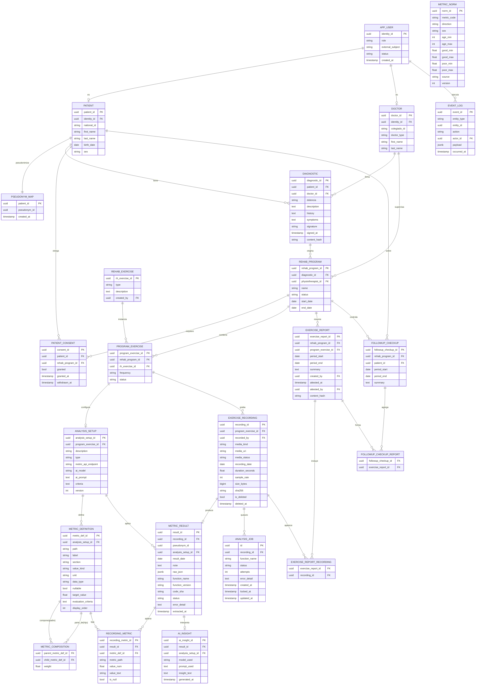

# Modelo entidad-relación — FTM

Modelo de datos del *Medical Rehab Follow-up Check-up Tool* (FTM), derivado del SDD v1.8.
Vista de conjunto; la autoridad sobre tipos y restricciones es `ftm_schema.sql` y el detalle por
columna está en el diccionario de datos.

> `METRIC_NORM` es un catálogo compartido (esquema `reference`): se enlaza con
> `METRIC_DEFINITION` por `metric_code` = `path` (enlace lógico por código, sin FK), por lo que
> aparece como entidad independiente.
>
> `PSEUDONYM_MAP` (esquema `clinical`) es el único vínculo identidad↔pseudónimo; el rol de IA no
> accede. `METRIC_RESULT.pseudonym_id` no tiene FK al mapa: borrarlo anonimiza las métricas. La
> IA lee solo la vista `metrics.v_ai_payload` (pseudónimo + valores).
