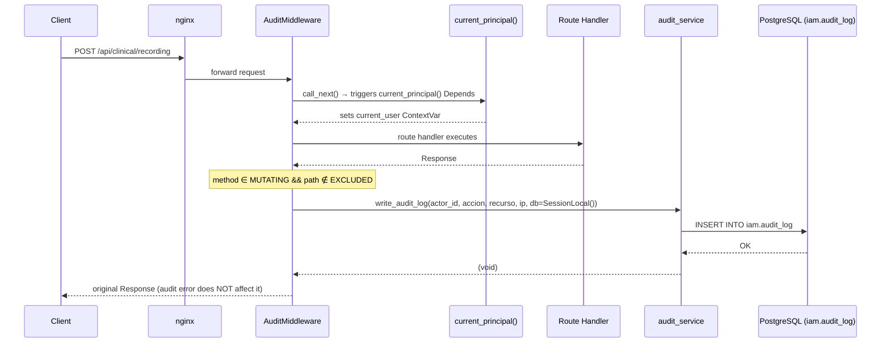

# Design: Audit Log — UC15

## Technical Approach

Introduce a thin `write_event_log` service function in the `iam` domain that inserts into the
pre-existing `audit.event_log` table (created in `ftm_schema.sql` / migration `0001_baseline`)
using a plain `SessionLocal()` connection (no `SET LOCAL ROLE` — the pool login user owns the
`audit` schema). Wire it into a `BaseHTTPMiddleware` on `main.py` that fires after every mutating
HTTP request. Expose a paginated `GET /iam/audit-log` endpoint restricted to the `admin` role,
enabled by a new `GRANT SELECT ON audit.event_log TO ftm_medical_specialist` in migration `0013`.

---

## Architecture Decisions

| Decision | Choice | Alternatives | Rationale |
|---|---|---|---|
| DB session in middleware | `SessionLocal()` directly, no `SET ROLE` | `get_db()` dependency / `system_session()` | `get_db()` is a FastAPI `Depends` tied to the request lifecycle and cannot be called from middleware. `system_session()` sets `ftm_worker` role but `ftm_worker` — like all app roles — has no `GRANT USAGE` on the `audit` schema (verified in `ftm_schema.sql` and `0004_runtime_grants.py`). The plain `SessionLocal()` runs as the pool login user (`ftm_app`) which owns the `audit` schema and can INSERT without `SET LOCAL ROLE`. |
| Table | `audit.event_log` (schema `audit`) | `iam.audit_log` | `audit.event_log` is the table defined in `ftm_schema.sql` (DDL source of truth). The `iam` schema does not exist in `bbdd_dev_setup`. |
| Audit fields | `entity_type`, `entity_id`, `action` (enum), `actor_id` (UUID), `payload` (jsonb), `occurred_at` | `accion` text + `recurso` text + `ip` | Matches the actual DDL. `entity_id` (UUID of the affected row) gives traceability per entity. `payload` captures diff/state. No `ip` column in `audit.event_log`. |
| `actor_id` type | `uuid` FK → `clinical.app_user.identity_id` | `text` (Keycloak `sub`) | The DDL defines `actor_id uuid REFERENCES clinical.app_user(identity_id)`. The middleware must resolve the Keycloak `sub` (from `current_user` ContextVar) to the internal `identity_id` before inserting. |
| `action` mapping | `POST`→`create`, `PUT`/`PATCH`→`update`, `DELETE`→`delete` | Free-text string | `audit.action` is a PostgreSQL enum `('create','update','delete')`. HTTP methods map deterministically. |
| Interception point | `BaseHTTPMiddleware` post-response | FastAPI dependency / signal/event hook | Middleware sees every request regardless of router, and runs after `call_next` so the response is already produced. Dependencies would require injection on every handler. |
| Mutation filter | `method in {POST, PUT, PATCH, DELETE}` | Log all methods | GET/HEAD/OPTIONS carry no state change; logging them inflates the table with noise and hides real mutations. |
| Actor resolution | `current_user.get()` ContextVar → resolve to `identity_id` | Re-parse Authorization header | `current_principal()` already decoded the JWT and set the ContextVar. A secondary DB lookup maps the Keycloak `sub` to the internal UUID. |
| Error isolation | `try/except Exception` + `logger.error` | Let audit exceptions propagate | An audit failure must never break the business operation. Swallowing after response is safe and correct. |
| `payload` content | JSONB diff or entity snapshot passed by the route handler | Full request body | Query strings / request bodies can contain PII. Payload is populated only when the route handler explicitly passes it to the audit call. |
| Excluded paths | `/health`, `/docs`, `/openapi.json`, `/redoc` | Regex blocklist | Fixed-set exclusion is explicit and predictable. |
| Pagination defaults | `limit=50`, `max=200` | No max / cursor-based | Admin console use-case; offset pagination is adequate at audit log volumes. Hard cap of 200 prevents accidental full-table dumps. |
| Response schema location | `api/app/iam/schemas.py` (new) | Inline in router | Consistent with the rest of the codebase (every domain has its own `schemas.py`). |
| Migration for SELECT grant | `0013_audit_select_grant.py` | Inline in baseline | `ftm_schema.sql` grants no access to `audit`. A separate migration adds `GRANT SELECT ON audit.event_log TO ftm_medical_specialist` so the `admin` role can query the log. |
| No `ip` column | Omitted | Add `ip text` column | IP is already captured by nginx in its access log — that is nginx's accountability layer. Storing it again in the clinical DB duplicates infrastructure data without clinical value and adds unnecessary surface area under RGPD data minimisation (Art. 5.1.c). |
| No `session_id` | Omitted | Add `session_id text` from JWT `sid` claim | Session lifecycle belongs to the IdP (Keycloak). The JWT already carries `sub` (actor) + `iat`/`exp` (time window). Tracing "what did this user do in this session" is achievable by filtering `actor_id` + `occurred_at` range — no app-side session state needed in the clinical DB. |

---

## Component Breakdown

### `api/app/iam/audit_service.py` (new)

```python
def write_event_log(
    *,
    entity_type: str,       # e.g. "recording.exercise_recording"
    entity_id: uuid.UUID | None,
    action: str,            # "create" | "update" | "delete"
    actor_id: uuid.UUID | None,  # clinical.app_user.identity_id (None if unauthenticated)
    payload: dict | None,
    db: Session,            # MUST be a plain SessionLocal() — not an RLS session
) -> None:
```

- Instantiates an `EventLog` ORM object (mapped to `audit.event_log`) and calls `db.add()` + `db.flush()`.
- `actor_id` is `uuid.UUID | None` — matches the FK type in the DDL. Unauthenticated requests insert `NULL`.
- Does **not** open or close its own session — the caller (middleware) owns the session lifetime.
- The middleware resolves the Keycloak `sub` (from `current_user` ContextVar) to the internal
  `identity_id` via `clinical.identity_id_for_subject()` before calling this function.

---

### `api/app/iam/schemas.py` (new)

```python
class EventLogEntry(BaseModel):
    event_id: uuid.UUID
    entity_type: str
    entity_id: uuid.UUID | None
    action: str              # "create" | "update" | "delete"
    actor_id: uuid.UUID | None
    payload: dict | None
    occurred_at: datetime

    model_config = ConfigDict(from_attributes=True)
```

---

### `api/app/iam/router.py` (new)

```
GET /iam/audit-log
```

| Parameter | Type | Default | Constraint |
|---|---|---|---|
| `actor_id` | `uuid.UUID \| None` | `None` | optional filter on `actor_id` |
| `entity_type` | `str \| None` | `None` | optional filter on `entity_type` |
| `from_ts` | `datetime \| None` | `None` | optional lower bound on `occurred_at` |
| `to_ts` | `datetime \| None` | `None` | optional upper bound on `occurred_at` |
| `limit` | `int` | `50` | `ge=1, le=200` |
| `offset` | `int` | `0` | `ge=0` |

- Requires `require_role("admin")`.
- Uses `get_db()` session — `admin` maps to `ftm_medical_specialist` in `DB_ROLE_BY_APP_ROLE`.
- **Requires migration `0013`**: `GRANT USAGE ON SCHEMA audit TO ftm_medical_specialist` + `GRANT SELECT ON audit.event_log TO ftm_medical_specialist`.
- Queries `EventLog` ordered by `occurred_at DESC`. Applies filters when provided.
- Returns `list[EventLogEntry]`.

---

### Middleware — `AuditMiddleware` in `api/app/main.py`

```python
class AuditMiddleware(BaseHTTPMiddleware):
    EXCLUDED = {"/health", "/docs", "/openapi.json", "/redoc"}
    MUTATING = {"POST", "PUT", "PATCH", "DELETE"}

    async def dispatch(self, request: Request, call_next):
        response = await call_next(request)
        if request.method in self.MUTATING and request.url.path not in self.EXCLUDED:
            db = SessionLocal()
            try:
                sub = current_user.get()
                # Resolve Keycloak sub -> internal identity_id (UUID FK in audit.event_log)
                actor_id = _resolve_identity_id(db, sub) if sub else None
                action = {"POST": "create", "PUT": "update",
                          "PATCH": "update", "DELETE": "delete"}[request.method]
                with db.begin():
                    write_event_log(
                        entity_type=request.url.path,   # route handler can pass entity_type explicitly
                        entity_id=None,                  # populated by route handler when available
                        action=action,
                        actor_id=actor_id,
                        payload=None,
                        db=db,
                    )
            except Exception:
                logger.error("audit write failed", exc_info=True)
            finally:
                db.close()
        return response
```

Registered **after** routers so that `current_principal()` has already populated the ContextVars:

```python
app.add_middleware(AuditMiddleware)
```

> **Note:** `add_middleware` wraps in reverse order — the last middleware added is the outermost
> layer. `AuditMiddleware` must be added **last** so it runs after auth has set the ContextVar.

---

## Data Flow



---

## Session Strategy for Middleware

`get_db()` is a FastAPI `Depends` generator — it relies on the dependency injection system tied
to the request lifecycle. Calling it from middleware code is not supported and would not yield
correctly.

`system_session()` sets `SET LOCAL ROLE ftm_worker`. However, `ftm_worker` — like **all** app
roles — has no `GRANT USAGE` on the `audit` schema (verified in `ftm_schema.sql` and
`0004_runtime_grants.py`). The same applies to `ftm_medical_specialist`, `ftm_patient`, etc.

The correct approach is a raw `SessionLocal()` **without** `SET LOCAL ROLE`. The connection pool
authenticates to PostgreSQL as the pool login user (`ftm_app`), which owns the `audit` schema
and has full INSERT access. No role switch is needed or desired.

```
SessionLocal()              ← pool connection as ftm_app (schema owner)
  └─ db.begin()
       └─ INSERT INTO audit.event_log ...
  └─ db.commit()
  └─ db.close()             ← always, in finally block
```

This is intentionally **not** an RLS session. Audit writes are privileged infrastructure — they
must succeed regardless of the requesting user's row-level permissions.

---

## Error Handling Strategy

| Layer | What can fail | Handling |
|---|---|---|
| `write_audit_log` | SQLAlchemy `IntegrityError`, DB down | Exception propagates up to middleware |
| `AuditMiddleware` | Any exception from `write_audit_log` | Caught by bare `except Exception`, logged via `logger.error(..., exc_info=True)`, **not** re-raised |
| `db.close()` | Session already closed / pool error | Inside `finally` — runs unconditionally; its own failure is swallowed silently |
| `GET /iam/audit-log` | DB error, bad filters | Standard FastAPI HTTP 500 — not silenced |

The guiding rule: **the audit system is an observer, not a gate**. A broken audit write must never
degrade user-facing functionality.

---

## Schema: `EventLogEntry`

```
EventLogEntry
├── event_id     : UUID            — primary key (audit.event_log.event_id)
├── entity_type  : str             — schema.table of affected entity (e.g. "recording.exercise_recording")
├── entity_id    : UUID | None     — UUID of the affected row (null when not resolvable at middleware level)
├── action       : str             — "create" | "update" | "delete"
├── actor_id     : UUID | None     — clinical.app_user.identity_id (null for unauthenticated)
├── payload      : dict | None     — JSONB diff or entity snapshot (null when not provided)
└── occurred_at  : datetime        — UTC timestamp (server-side default)
```

No pagination envelope is returned — the list is the response body. Future versions can add
`X-Total-Count` response header if needed.

---

## Files Affected

| File | Action | Notes |
|---|---|---|
| `api/app/iam/audit_service.py` | Create | `write_event_log()` — inserts into `audit.event_log` |
| `api/app/iam/schemas.py` | Create | `EventLogEntry` Pydantic model |
| `api/app/iam/router.py` | Create | `GET /iam/audit-log` endpoint |
| `api/app/iam/models.py` | Create/Update | Add `EventLog` ORM model mapped to `audit.event_log` |
| `api/app/iam/__init__.py` | No change | Already exists (empty) |
| `api/app/main.py` | Modify | Import `AuditMiddleware`, `add_middleware` call, import iam router |
| `api/app/db.py` | No change | `SessionLocal` and `_resolve_identity_id` already module-level |
| `bbdd_dev_setup/alembic/migrations/versions/0013_audit_select_grant.py` | Create | `GRANT USAGE ON SCHEMA audit` + `GRANT SELECT ON audit.event_log TO ftm_medical_specialist` |

---

## Out of Scope

- Frontend UI for browsing the audit log (separate UC).
- Audit log rotation / archival policy.
- Logging GET requests (explicit decision above).
- Structured log shipping (ELK/Loki) — `logger.error` goes to container stdout for now.
