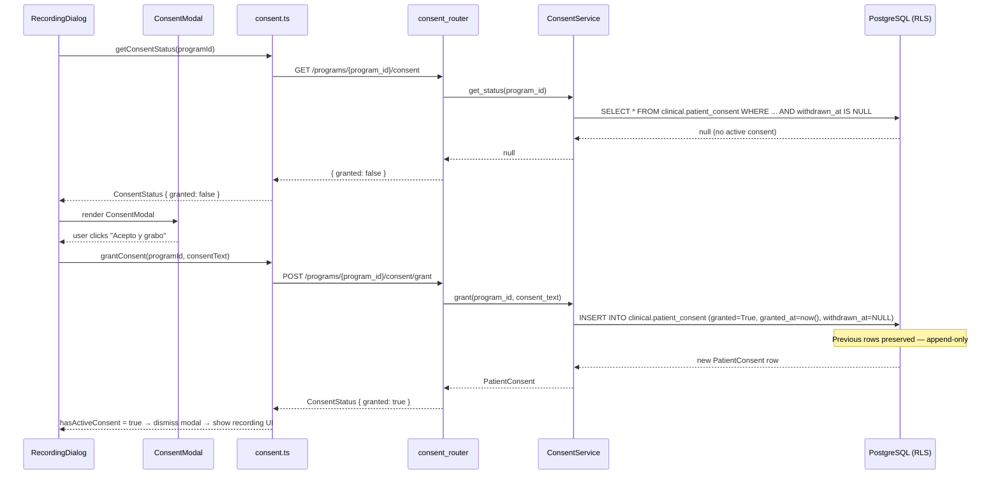
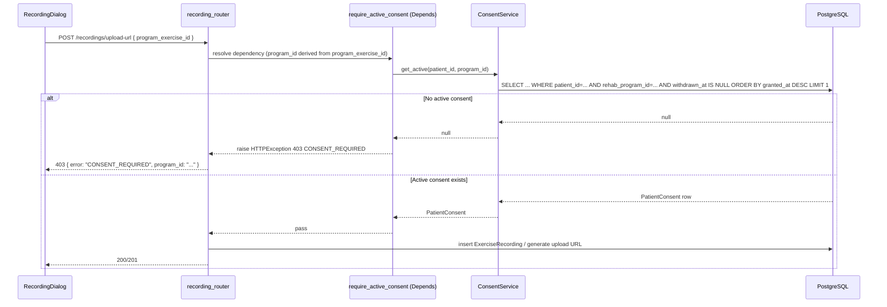

# Design: RGPD Consent Gate — UC5

## Technical Approach

Add a thin `ConsentService` in the `clinical` domain backed by the existing `clinical.patient_consent` table. A FastAPI dependency `require_active_consent` wraps the service and is injected into the three recording write handlers. Frontend replaces the fake checkbox in `RecordingDialog` with an API-driven status check that renders `ConsentModal` when no active consent exists. An Alembic migration adds the missing RLS write policies so `ftm_patient` can INSERT/UPDATE its own consent rows.

## Architecture Decisions

| Decision | Choice | Alternatives | Rationale |
|---|---|---|---|
| Service placement | New `ConsentService` in `clinical` domain | Extend `ProgramExerciseAccessService` | Access service is used on read/delete paths too; consent guard must be write-only. |
| Guard injection point | FastAPI `Depends()` on write handlers | Middleware / RLS-only | Dependency injection gives explicit, testable boundaries without touching read/delete call chains. |
| `patient_id` resolution | `db.info["identity_id"]` → JOIN `clinical.app_user` → `clinical.patient` | Carry patient_id in JWT custom claim | Matches existing pattern in `register_recording` (line 132 of router.py); no JWT schema change needed. |
| Grant strategy | Always INSERT new row (append-only) | Upsert (UPDATE existing row or INSERT) | RGPD audit trail: each grant/withdraw cycle must be independently verifiable. An upsert would destroy evidence that a withdrawal occurred between two grants. Append-only means the full consent history is always queryable. The UNIQUE constraint on `(patient_id, rehab_program_id)` must be dropped. |
| Withdraw strategy | SET `withdrawn_at = now()` | Hard delete row | Audit trail requirement EC-7; recordings row history must survive withdrawal. |
| Migration scope | RLS write policies + GRANT only | Full table DDL | `clinical.patient_consent` already exists in `ftm_schema.sql`; migration only adds what is missing. |
| Frontend consent check timing | `useEffect` on dialog open → `GET .../consent` | Inline with first upload attempt | Fails early with clear UX; avoids mid-upload 403 surprises. |
| `ConsentModal` placement | Rendered inside `RecordingDialog` overlay | Separate route/page | Keeps the consent-to-record flow atomic; no navigation needed. |

### Why Append-Only Consent

> RGPD audit trail: each grant/withdraw cycle must be independently verifiable. An upsert would destroy evidence that a withdrawal occurred between two grants. Append-only means the full consent history is always queryable.

Consequences:
- The UNIQUE constraint `(patient_id, rehab_program_id)` is dropped in migration `0012`.
- `grant()` always issues a plain `INSERT` — no conflict handling needed.
- `get_active()` and `get_status()` always use `ORDER BY granted_at DESC LIMIT 1` to resolve the current state from the latest row.
- `withdraw()` targets the most recent active row via `WHERE withdrawn_at IS NULL ORDER BY granted_at DESC LIMIT 1`.
- `ConsentAlreadyActiveError` is removed — re-granting is always valid and creates a traceable record.
- `ConsentAlreadyWithdrawnError` is removed — simplified error surface; only `ConsentNotFoundError` remains for withdraw-with-no-active-row.

## Data Flow

### Grant Consent Flow



### Recording Write with Consent Check



### Patient Identity Resolution

```
JWT sub (Keycloak UUID)
  -> db.info["identity_id"]      [set by auth middleware from JWT]
  -> SELECT patient_id FROM clinical.patient
     JOIN clinical.app_user ON patient.identity_id = app_user.identity_id
     WHERE app_user.external_subject = :sub
  -> patient_id (UUID)           [used in ConsentService queries]
```

## File Changes

| File | Action | Description |
|------|--------|-------------|
| `bbdd_dev_setup/alembic/migrations/versions/0012_consent_rls_policy.py` | Create | RLS INSERT/UPDATE policies + GRANT for `ftm_patient` on `clinical.patient_consent` |
| `api/app/clinical/models.py` | Modify | Add `PatientConsent` ORM model |
| `api/app/clinical/consent_service.py` | Create | `ConsentService` with `get_active`, `get_status`, `grant`, `withdraw` |
| `api/app/clinical/consent_router.py` | Create | 3 endpoints under `/programs/{program_id}/consent` |
| `api/app/recording/router.py` | Modify | Inject `require_active_consent` dependency into `upload_url`, `register_recording`, `local_upload` |
| `web/src/api/consent.ts` | Create | `ConsentApi` type + fetch wrappers for the 3 consent endpoints |
| `web/src/features/patient/ConsentModal.tsx` | Create | RGPD modal component; props `{ programId, api, onGranted, onCancel }` |
| `web/src/features/patient/PatientPortal.tsx` | Modify | Replace fake checkbox with consent status check + `ConsentModal` render |
| `api/tests/test_consent.py` | Create | Integration tests for grant / withdraw / re-grant / 403 guard scenarios |

## Interfaces / Contracts

### `PatientConsent` ORM model (`api/app/clinical/models.py`)

```python
class PatientConsent(Base):
    __tablename__ = "patient_consent"
    __table_args__ = {"schema": SCHEMA}
    # No UniqueConstraint — table is append-only; multiple rows per (patient_id, rehab_program_id) are expected.

    consent_id = Column(UUID(as_uuid=True), primary_key=True, server_default=text("gen_random_uuid()"))
    patient_id = Column(UUID(as_uuid=True), ForeignKey(f"{SCHEMA}.patient.patient_id"), nullable=False)
    rehab_program_id = Column(UUID(as_uuid=True), ForeignKey(f"{SCHEMA}.rehab_program.rehab_program_id"), nullable=False)
    granted = Column(Boolean, nullable=False, default=True)
    granted_at = Column(DateTime(timezone=True), server_default=text("now()"))
    withdrawn_at = Column(DateTime(timezone=True), nullable=True)
    consent_text = Column(Text, nullable=True)  # nullable in DB; required at application layer via ConsentIn schema
```

### `ConsentService` (`api/app/clinical/consent_service.py`)

```python
class ConsentService:
    def __init__(self, db: Session): ...

    def get_active(self, patient_id: UUID, program_id: UUID) -> PatientConsent | None:
        # SELECT ... WHERE patient_id=... AND rehab_program_id=... AND withdrawn_at IS NULL
        # ORDER BY granted_at DESC LIMIT 1

    def get_status(self, program_id: UUID) -> PatientConsent | None:
        # Resolves patient_id from db.info["identity_id"]
        # SELECT ... WHERE patient_id=... AND rehab_program_id=... ORDER BY granted_at DESC LIMIT 1
        # Returns most recent row regardless of withdrawn_at (lets caller decide state)

    def grant(self, program_id: UUID, consent_text: str) -> PatientConsent:
        # Always INSERT a new row: granted=True, granted_at=now(), withdrawn_at=None, consent_text=consent_text
        # consent_text is the RGPD text string accepted by the patient; mandatory parameter (enforced by ConsentIn schema)
        # No upsert — append-only for RGPD audit trail
        # No ConsentAlreadyActiveError — re-grant is always allowed and recorded

    def withdraw(self, program_id: UUID) -> PatientConsent:
        # UPDATE the most recent active row (WHERE withdrawn_at IS NULL ORDER BY granted_at DESC LIMIT 1)
        # SET withdrawn_at=now()
        # Raises ConsentNotFoundError if no active row exists
        # No ConsentAlreadyWithdrawnError — simplified error surface
```

### Consent Router endpoints (`api/app/clinical/consent_router.py`)

```
GET  /programs/{program_id}/consent          → ConsentStatus
POST /programs/{program_id}/consent/grant    body: ConsentIn { consent_text: str } → ConsentOut
POST /programs/{program_id}/consent/withdraw → ConsentStatus
```

```python
class ConsentIn(BaseModel):
    consent_text: str  # required — the RGPD text string accepted by the patient at grant time

class ConsentOut(BaseModel):
    consent_id: uuid.UUID | None
    program_id: uuid.UUID
    granted: bool
    granted_at: datetime | None
    withdrawn_at: datetime | None
    consent_text: str | None  # optional — may be None for rows migrated before this column was added

# ConsentStatus (used in GET response and withdraw response — no body, so no consent_text required)
class ConsentStatus(BaseModel):
    consent_id: uuid.UUID | None
    program_id: uuid.UUID
    granted: bool
    granted_at: datetime | None
    withdrawn_at: datetime | None
```

### Recording guard dependency (`api/app/recording/router.py`)

```python
def require_active_consent(
    body: UploadUrlIn | RecordingIn,  # or program_exercise_id param
    db=Depends(get_db),
    principal=Depends(require_role("patient", "medical")),
) -> None:
    # Resolves program_id from program_exercise_id via DB join
    # Calls ConsentService(db).get_active(patient_id, program_id)
    # If None: raise HTTPException(403, {"error": "CONSENT_REQUIRED", "program_id": str(program_id)})
    # Medical role: guard skipped (medical staff do not self-consent)
```

### Frontend API client (`web/src/api/consent.ts`)

```ts
type ConsentStatus = {
  consent_id: string | null;
  program_id: string;
  granted: boolean;
  granted_at: string | null;
  withdrawn_at: string | null;
};

type ConsentApi = {
  getConsentStatus(programId: string): Promise<ConsentStatus>;
  grantConsent(programId: string, consentText: string): Promise<ConsentStatus>;
  withdrawConsent(programId: string): Promise<ConsentStatus>;
};
```

## Migration — `0012_consent_rls_policy.py`

```
revision = "0012_consent_rls_policy"
down_revision = "0011_seed_metric_norms"
```

`upgrade()` runs 5 `op.execute()` calls (pattern from `0010_followup_checkup.py`):

0. `ALTER TABLE clinical.patient_consent DROP CONSTRAINT IF EXISTS patient_consent_patient_id_rehab_program_id_key` — removes the UNIQUE constraint from `ftm_schema.sql` to allow multiple rows per patient+program (append-only model)
0b. `ALTER TABLE clinical.patient_consent ADD COLUMN IF NOT EXISTS consent_text TEXT` — stores the RGPD consent text accepted by the patient at grant time; nullable in DB to avoid breaking existing rows, required at application layer
1. `DROP POLICY IF EXISTS consent_patient_insert` + `CREATE POLICY consent_patient_insert FOR INSERT TO ftm_patient WITH CHECK (patient_id = clinical.current_patient_id())`
2. Same for UPDATE policy `consent_patient_update`
3. `GRANT INSERT, UPDATE ON clinical.patient_consent TO ftm_patient`
4. (No further DDL — table already in `ftm_schema.sql`)

`downgrade()` drops the two policies and revokes the grants.

## Edge Cases

| Case | Handling |
|---|---|
| Patient re-grants after withdrawal | `grant()` INSERTs a new row; old withdrawn row is preserved for audit trail |
| Patient tries to grant for a program they are not enrolled in | RLS WITH CHECK `patient_id = current_patient_id()` blocks INSERT; router also validates `RehabProgram` exists via patient's diagnostic chain |
| Medical staff records for patient | `require_active_consent` skips guard for `role == "medical"`; consent is patient's own act |
| JS error prevents modal render | Guard is at API level; 403 is returned on any write attempt without DB consent row |
| Concurrent grant requests | No UNIQUE constraint — duplicate inserts are allowed (append-only); both rows are valid audit records. Application layer does not need to deduplicate. |
| Existing recordings before this change | No backfill migration; patients must re-grant once; documented in release notes (per proposal) |

## Testing Strategy

| Layer | What to Test | Approach |
|-------|-------------|----------|
| Unit | `ConsentService.grant` always inserts a new row, `withdraw` updates most recent active row, `ConsentNotFoundError` on withdraw without active row | pytest with SQLite/mock session |
| Integration | RLS blocks cross-patient grant; 403 on recording write without consent; 201 after grant | `RUN_INTEGRATION=1` with real PostgreSQL via `api/tests/test_consent.py` |
| Integration | Re-grant after withdrawal inserts a new row; old row preserved with `withdrawn_at` set | Same test file |
| Frontend unit | `ConsentModal` renders RGPD text, calls `grantConsent`, fires `onGranted` | Vitest + Testing Library |
| Frontend unit | `RecordingDialog` shows modal when `granted=false`, hides modal after grant | Vitest |

## Migration / Rollout

1. Deploy migration `0012` (adds policies + grants, no data touched)
2. Deploy API (`PatientConsent` model, `ConsentService`, `consent_router`, guard on recording writes)
3. Deploy frontend (`ConsentModal`, updated `RecordingDialog`)
4. Existing patients without consent records will see the modal on next recording attempt — expected UX, documented in release notes

Rollback: `alembic downgrade -1` drops write policies; recording guard can be reverted independently; `clinical.patient_consent` rows survive intact.

## Open Questions

- [ ] `program_id` must be derived inside `require_active_consent` from `program_exercise_id` — requires one extra JOIN. Confirm this is acceptable latency-wise or pre-join in `ProgramExerciseAccessService`.
- [ ] RGPD consent text version: should `consent_text` stored in the DB row come from the frontend string or a server-side canonical text? Current design stores what the frontend sends; consider server-side versioned text blob later.
