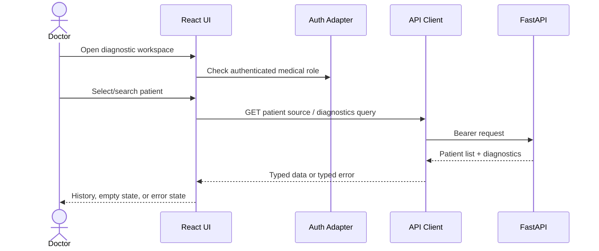
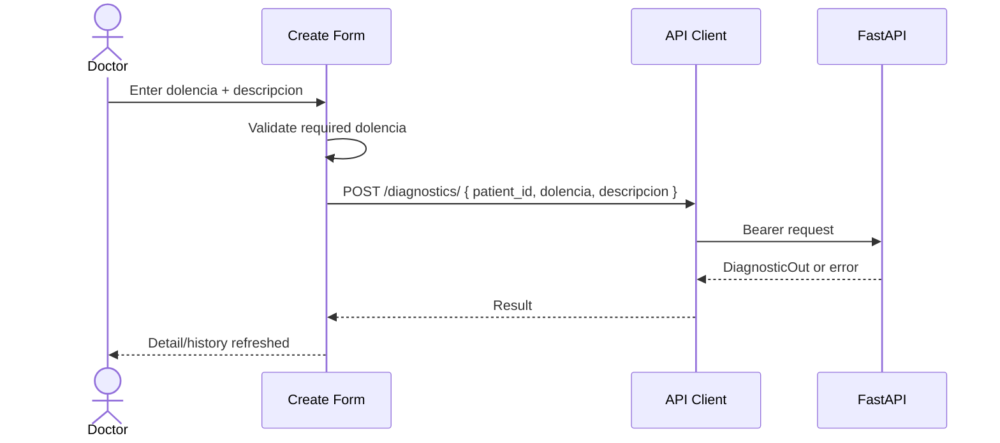

# Design: Doctor Diagnostic UI (UC-01)

**Change**: `ui-medico-diagnostico-uc1`  
**Date**: 2026-06-14  
**Status**: Technical Design  
**Scope**: Frontend/UI only for UC-01

---

## Technical Approach

Implement **Option A: Minimal UC-01 SPA slice first**. Create a small `web/` React 18 + Vite + TypeScript app if no frontend exists, then add a diagnostic feature module with auth shell, typed API client, patient selector, diagnostic history, create form, detail view, and edit form.

The design covers only AC-01 and AC-03. UC-02 and broader clinical UI remain out of scope.

---

## Architecture Decisions

| Decision | Choice | Alternatives | Rationale |
|---|---|---|---|
| Frontend root | `web/` | `frontend/`, `ui/` | ADR-0003 describes a web SPA; `web/` is concise and keeps API separate. |
| Scope shape | Minimal UC-01 feature slice | Full clinical shell | Delivers AC-01/AC-03 without dragging UC-02 into review. |
| Auth boundary | `web/src/auth/` adapter | Keycloak calls in components | Keeps `keycloak-js` and dev/mock auth replaceable for tests. |
| API boundary | `web/src/api/` typed client | Fetch calls in components | Centralizes DTOs, errors, bearer token handling, and response drift. |
| State | TanStack Query hooks per resource | Local component state only | ADR-0003 names TanStack Query; it fits loading/error/cache invalidation. |
| Tests | Vitest + Testing Library if scaffolded | E2E first | Fast component/API-client tests are enough for the first UC-01 slice. |

> TODO (confirm): exact frontend test runner. Vitest + Testing Library is proposed because it fits Vite, but the SDD/ADR do not name a test runner.

---

## Data Flow

### AC-01: Patient selection and diagnostic history



### AC-03: Create diagnostic



---

## File Changes

| File | Action | Description |
|---|---|---|
| `web/package.json` | Create | React/Vite/TS dependencies and scripts. |
| `web/vite.config.ts` | Create | Vite config and test config if Vitest is chosen. |
| `web/tsconfig.json` | Create | Strict TypeScript config. |
| `web/src/main.tsx` | Create | React entrypoint. |
| `web/src/App.tsx` | Create | App shell and route outlet. |
| `web/src/auth/authClient.ts` | Create | Auth adapter for Keycloak/dev test auth. |
| `web/src/api/http.ts` | Create | Fetch wrapper with bearer token and typed errors. |
| `web/src/api/diagnostics.ts` | Create | UC-01 diagnostic API functions and DTOs. |
| `web/src/api/patients.ts` | Create | Patient list/search API functions. |
| `web/src/features/diagnostics/DiagnosticWorkspace.tsx` | Create | UC-01 page container. |
| `web/src/features/diagnostics/components/*` | Create | Patient selector, history list, forms, detail card, error states. |
| `web/src/features/diagnostics/hooks.ts` | Create | TanStack Query hooks and mutation invalidation. |
| `web/src/features/diagnostics/*.test.tsx` | Create | AC-01/AC-03 component tests. |
| `.github/workflows/ci.yml` | Modify | Add frontend install/lint/test/build when scaffold exists. |

---

## Interfaces / Contracts

```ts
type UserRole = "medical" | "patient" | "technician" | "admin";

type PatientOut = {
  id: string;
  nombre: string;
  apellidos: string;
};

type DiagnosticIn = {
  patient_id: string;
  dolencia: string;
  descripcion?: string | null;
};

type DiagnosticOut = {
  id: string;
  patient_id: string;
  dolencia: string;
  descripcion?: string | null;
  created_at?: string | null;
  updated_at?: string | null;
  signature?: string | null;
  signed_at?: string | null;
  content_hash?: string | null;
};

type PaginatedResponse<T> = {
  items?: T[];
  data?: T[];
  total: number;
  limit: number;
  offset: number;
};
```

The UI API client will normalize `items` vs `data` to one internal array shape because current API/OpenSpec artifacts have drift.

---

## Testing Strategy

| Layer | What to Test | Approach |
|---|---|---|
| Unit | DTO normalization, form validation, typed error mapping | Vitest unit tests. |
| Component | Patient selector, history list, create form, detail/edit states | Testing Library with mocked API/auth. |
| Integration | Query hooks success/error/invalidation | Mock Service Worker or fetch mock. |
| E2E | Full Keycloak + backend flow | Deferred until frontend foundation is stable. |

Tests SHOULD reference AC-01 or AC-03 in names or docstrings.

---

## Migration / Rollout

No data migration required. Rollout is additive:

1. Add `web/` app without changing backend.
2. Add frontend CI jobs.
3. Wire nginx route `/` to the SPA when deployment is ready.

Rollback: remove `web/` and frontend CI/nginx route; `/api` and `/realms` remain unchanged.

---

## Open Questions

- [ ] Exact patient lookup endpoint for AC-01: `GET /patients`, filtered `GET /diagnostics`, or a future patient search endpoint?
- [ ] Local auth mode: mock auth adapter, real Keycloak, or both?
- [ ] Confirm frontend test runner: Vitest + Testing Library proposed.
- [ ] Confirm whether API response envelope is `items` or `data` before implementation hardens contracts.
