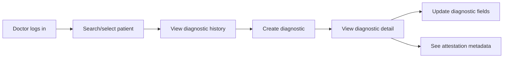

# Exploration: Doctor Diagnostic UI (UC-01)

**Change**: `ui-medico-diagnostico-uc1`  
**Date**: 2026-06-14  
**Scope**: Frontend/UI only for UC-01 Diagnostic Assessment  
**Status**: Exploration Complete

---

## Goal

Build the doctor-facing UI for **UC-01: Diagnostic Assessment** only. The UI lets a medical user find/select a patient, review diagnostic history, create a diagnostic, inspect diagnostic detail, and update diagnostic fields.

Out of scope for this change: UC-02 rehab program UI, exercise assignment UI, patient-facing diagnostic UI, recording UI, metrics, reports, follow-up check-ups, and LLM insight.

---

## Source Traceability

| Source | Relevant content |
|---|---|
| SDD §4 UC-01 | Medical Specialist performs a diagnostic assessment; diagnostic is registered for the patient and signed/attested by the specialist. |
| SDD §9 AC-01 | Doctor searches for Patient and finds patient diagnostic history. |
| SDD §9 AC-03 | Doctor explores a Patient and can create a Diagnosis linked to the user. |
| ADR-0003 | Frontend is React 18 + Vite + TypeScript, with TanStack Query, Recharts, `keycloak-js`. |
| ADR-0004 | SPA uses Keycloak Authorization Code + PKCE S256; backend is bearer-only. Roles: `medical`, `patient`, `technician`, `admin`. |
| ADR-0012 | Diagnostic attestation is simple MVP attestation: doctor identity + timestamp + content hash; not qualified eIDAS signature. |

---

## Current State

### Frontend

No frontend scaffold was found in the repository during exploration:

- No `package.json`
- No `vite.config.*`
- No `tsconfig*.json`
- No `web/`, `frontend/`, or UI source root detected

Therefore the UC-01 UI work likely starts by creating the React/Vite/TypeScript app structure.

### Backend API dependency

The UI depends on the doctor diagnostic API previously specified in `api-medico-diagnostico-programa`:

- `GET /diagnostics` — list diagnostic history visible to the authenticated doctor
- `POST /diagnostics/` — create diagnostic
- `GET /diagnostics/{diagnostic_id}` — diagnostic detail
- `PATCH /diagnostics/{diagnostic_id}` — update diagnostic

The UI also needs a patient search/list capability to satisfy AC-01/AC-03:

- Existing API exploration referenced `GET /patients`
- If there is no patient detail/search endpoint, the first UI iteration can use the available patient list and select a patient from it

> TODO (to confirm during spec/design): exact patient lookup endpoint and response contract to use for “Doctor searches for Patient”.

---

## Affected Areas

| Area | Expected path | Why affected |
|---|---|---|
| Frontend app scaffold | `web/` or `frontend/` | No current SPA detected; ADR-0003 requires React 18 + Vite + TypeScript. |
| Routing | `web/src/routes` or equivalent | UC-01 needs doctor diagnostic pages and protected routing. |
| Auth integration | `web/src/auth` or equivalent | UI must use Keycloak PKCE flow and role-aware route guards (ADR-0004). |
| API client | `web/src/api` or equivalent | UI needs typed calls to diagnostic and patient endpoints. |
| Query/state | `web/src/features/diagnostics` | TanStack Query should handle list/detail/create/update states (ADR-0003). |
| Forms | `web/src/features/diagnostics/components` | Diagnostic create/update requires validation and error display. |
| Tests | `web/src/**/*.test.*` or `web/tests` | AC-tagged component/API-client tests should cover UC-01 behavior. |

---

## User Journey for UC-01

Expected UI screens:

1. **Doctor Diagnostic Home**
   - Shows patient search/list entry point
   - Shows diagnostic history once a patient is selected or lists recent diagnostics if backend supports it

2. **Create Diagnostic Form**
   - Fields: `patient_id` selection, `dolencia`, `descripcion`
   - Does not accept `doctor_id` from the user; backend injects doctor identity
   - Shows validation errors for empty/too-long `dolencia` and too-long `descripcion`

3. **Diagnostic Detail**
   - Shows `dolencia`, `descripcion`, patient id/display data if available
   - Shows `signature`, `signed_at`, `content_hash` when returned by API
   - Makes clear this is MVP attestation, not qualified electronic signature (ADR-0012)

4. **Edit Diagnostic Form**
   - Supports patching `dolencia` and/or `descripcion`
   - Shows success/error states and refetches detail/history

---

## Approaches

### Option A — Minimal UC-01 SPA slice first

Create a small React/Vite app with only auth shell, patient selector, diagnostic list, create form, detail, and update form.

| Pros | Cons | Effort |
|---|---|---|
| Fastest path to visible UC-01 value | May need later restructuring for UC-02 and reporting | Medium |
| Keeps scope tight and reviewable | Requires frontend scaffold decisions now | Medium |
| Directly maps to AC-01 and AC-03 | UI may depend on incomplete patient search contract | Medium |

### Option B — Full clinical frontend shell first

Create a larger app shell with navigation for diagnostics, programs, recordings, metrics, reports, and follow-up, but only implement UC-01 screens.

| Pros | Cons | Effort |
|---|---|---|
| Future navigation is anticipated | More code before first UC-01 value | High |
| Easier to add UC-02 later | Higher review burden | High |
| Better layout consistency | More speculative because only UC-01 is requested | High |

### Option C — Component prototypes without backend integration

Create static/mock components and defer real API integration.

| Pros | Cons | Effort |
|---|---|---|
| Quick visual feedback | Does not prove UC-01 flow end-to-end | Low |
| Avoids backend contract uncertainty | TanStack Query/auth integration delayed | Low |
| Useful if PO wants wireframes first | Less aligned with how API work was developed/tested | Low |

---

## Recommendation

Use **Option A: Minimal UC-01 SPA slice first**.

This matches how the API was developed: narrow scope, acceptance-criteria traceability, tests, and reviewable increments. It avoids building UC-02 or unrelated clinical UI before the doctor diagnostic flow is proven.

Suggested PR split:

| PR | Goal | Notes |
|---|---|---|
| PR #1 | Frontend foundation | React/Vite/TS scaffold, Keycloak/dev auth shell, API client, test setup. |
| PR #2 | Diagnostic history/search UI | Patient selector/search, diagnostic history list, loading/empty/error states. Covers AC-01. |
| PR #3 | Diagnostic create/detail/update UI | Create form, detail view, patch form, attestation display. Covers AC-03. |

---

## Risks

- **No frontend exists yet**: bootstrap decisions must be made carefully and kept minimal.
- **Patient search contract may be incomplete**: UI needs a reliable way to find/select a patient for AC-01/AC-03.
- **API/OpenSpec drift**: current API implementation should be verified before final UI spec/design, especially response envelope names (`data` vs `items`) and attestation fields.
- **Auth test complexity**: Keycloak PKCE is required by ADR-0004, but local/dev test strategy may need a mock auth provider.
- **Scope creep into UC-02**: program creation/rehab plan UI must stay out of this UC-01 change.

---

## Open Questions

1. What frontend root should be used: `web/` as in common ADR naming, or another path?
2. Should local development use real Keycloak immediately, or a dev auth adapter that mirrors `auth_mode=dev`?
3. What exact patient search endpoint should the UI use for “Doctor searches for Patient”?
4. Should diagnostic history be patient-filtered in the first UI version, or should it start from all doctor-visible diagnostics?
5. Which test runner should be used for React: Vitest + Testing Library, or another setup?

---

## Ready for Proposal

Yes. The scope is now narrow enough for a proposal/spec/design/tasks cycle:

- Change: `ui-medico-diagnostico-uc1`
- Scope: Frontend/UI only for UC-01
- Acceptance criteria: AC-01 and AC-03 only
- Exclusions: UC-02 programs, recordings, metrics, reports, follow-up, patient-facing UI
